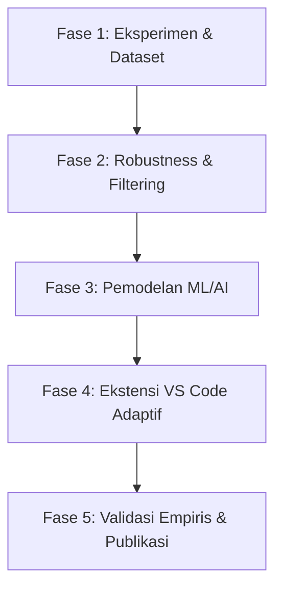

# 🧠 Adaptive IDE: Brainstorming, Progres Implementasi, dan Roadmap Riset

**Judul Penelitian:** *Antarmuka Adaptif IDE Berdasarkan Beban Kognitif Developer Menggunakan Machine Learning dan Fusi Sensor Multimodal*  
**Tanggal Update:** 19 September 2026  
**Repositori:** `Adaptive-IDE`

---

## 👥 Tim Peneliti

- **Ketua Peneliti:** Hadipurnawan Satria, Ph.D
- **Dosen Peneliti:**
  1. Anggina Primanita, S.Kom., M.I.T., Ph.D.
  2. Julian Supardi, S.Pd., M.T., Ph.D
  3. Alvi Syahrini Utami, S.Si., M.Kom
- **Tim Peneliti Mahasiswa:**
  - **Sub-Tim Heart Rate (HRV):** Muhammad Alif Berri Rossi, Fitran Husein
  - **Sub-Tim Eye Tracking:** M. Suheil Ichma Putra, M. Rabyndra Janitra Binello, Monica Amrina Rosyada

---

## 1. 💡 Hal-Hal yang Sudah Dibrainstorming

Bagian ini merangkum seluruh ideasi, diskusi kebutuhan hardware/software, landasan teori ilmiah, dan keputusan arsitektur sistem:

### A. Landasan Teori & Cognitive Load Theory (CLT)
- **Problem Statement:** Lingkungan IDE modern membebani programmer dengan informasi visual berlebih (*extraneous cognitive load*), terutama saat menghadapi bug rumit (*high intrinsic load*), yang memicu kelelahan mental, penurunan fokus, dan frustrasi.
- **Tujuan Sistem:** Membangun IDE neuroergonomis yang dapat mengenali kondisi kognitif developer secara *real-time* lewat sinyal fisiologis non-invasif dan menyesuaikan antarmuka secara dinamis untuk mengoptimalkan *germane load* serta memangkas *extraneous load*.
- **5 State Kognitif Developer (Berdasarkan Paper Literatur):**
  1. 🟢 **Focused (Flow State):** Dwell time panjang di editor utama, NRevisit rendah, pupil & HRV stabil.
  2. 🟡 **Confused:** NRevisit tinggi, pupil membesar (*Task-Evoked Pupillary Response*), HRV menurun, gaze bolak-balik ke baris error.
  3. 🔵 **Scanning:** Gaze melompat cepat antarseksi, saccade velocity tinggi, dwell time pendek (membangun *mental model*).
  4. 🔴 **Overloaded:** Gaze acak/disorientasi, sympathetic arousal tinggi (HRV sangat rendah, pupil dilatasi ekstrem).
  5. 🟣 **Vibecoding:** Pola bolak-balik cepat antara chat AI agent ↔ editor kode tanpa jeda pemahaman mendalam (*deferring thought*).

### B. Pemilihan & Komparasi Sensor Biometrik
- **Heart Rate / HRV:**
  - *ECG vs. PPG:* ECG (chest strap) lebih presisi namun invasif/kurang nyaman untuk sesi koding panjang. Dipilih **PPG (Photoplethysmography)**.
  - *BPM vs. HRV:* Beat-Per-Minute (BPM) standar tidak cukup sensitif terhadap beban kerja mental. Parameter yang wajib diambil adalah **Heart Rate Variability (HRV)** berbasis **RR-Intervals (Inter-Beat Interval)** seperti **RMSSD** dan **SDNN**.
  - *Pemilihan Perangkat:* Smart Band komersial (Xiaomi Band/Vela JS) membatasi akses streaming RR real-time. Smart Watch Wear OS relatif mahal. Dipilih **Coospo HW9 HRM Armband** karena menggunakan protokol standar **Bluetooth Low Energy (BLE)** Heart Rate Service (UUID `0x180D` / `0x2A37`) yang mem-broadcast RR interval secara kontinu dengan latensi rendah dan biaya terjangkau.
- **Eye Tracking:**
  - Menghindari hardware eye tracker komersial mahal ($$$) atau software game controller berbayar.
  - Menggunakan **Webcam standar / 60 FPS** berbasis library Computer Vision & Machine Learning (**MediaPipe Face Mesh + Iris Landmarks**).
  - Mengukur: koordinat gaze pada layar, fiksasi, sakade, blink rate, dan rasio diameter pupil.

### C. Konsep Desain Intervensi Antarmuka IDE (VS Code)
- **Katalog Fitur Adaptif:**
  - *Saat Focused:* Otomatis masuk ke mode minimalis / Zen Mode (sembunyikan sidebar, mini-map, dan notifikasi).
  - *Saat Confused:* Tampilkan highlight bantuan kontekstual, perluas font area error, atau tawarkan dokumentasi ringkas.
  - *Saat Overloaded:* Kurangi visual clutter, redam peringatan non-kritis, dan sarankan micro-break pemulihan kognitif.
  - *Saat Scanning:* Pertahankan overview navigasi file dan struktur outline yang jelas.

---

## 2. 🛠️ Hal-Hal yang Sudah Dilakukan (Implementasi Saat Ini)

Berikut implementasi teknis dan fungsionalitas yang telah berhasil diselesaikan di dalam repositori:

### A. Sub-Sistem HRV Monitor (`hrv_monitor_prototype`)
1. **Perekaman BLE RR Interval (`record_rr.py`):**
   - Implementasi parser paket BLE standar `00002a37-0000-1000-8000-00805f9b34fb`.
   - Konversi unit RR (1/1024 detik) ke milidetik secara presisi.
   - **Fitur Auto-Detection:** Pencarian sensor otomatis berbasis nama (`HW9`) via `BleakScanner` tanpa mengharuskan input manual, dengan fallback flag manual `--address`.
2. **Preprocessing & Kalibrasi Personal (`preprocess_rr.py`, `calibrate.py`):**
   - **Protokol Kalibrasi Baseline:** Pengambilan data istirahat selama 120 detik (maksimum batas toleransi 300 detik) untuk menentukan baseline fisiologis individual setiap partisipan.
   - **Filter Artefak:** Filtering gap data dan spike median threshold.
3. **Kalkulasi Metrik HRV (`calculate_hrv.py`):**
   - Sliding window 25 detik dengan pergeseran (step) 5 detik.
   - Kalkulasi metrik **RMSSD** (Root Mean Square of Successive Differences) dan **SDNN** (Standard Deviation of NN intervals).
   - Pencatatan otomatis ke `rr_raw.csv` dan `hrv.csv`.

### B. Sub-Sistem Eye Tracking (`eye_tracking_prototype`)
1. **Iris & Gaze Tracking:**
   - Ekstraksi 468 landmark wajah dan landmark iris MediaPipe.
   - Deteksi kedipan (*Eye Aspect Ratio* / EAR) dan perhitungan rasio pupil.
2. **Kalibrasi Layar & Head Alignment:**
   - UI kalibrasi layar interaktif berbasis grid titik (*modular N-point layout*).
   - Algoritma pemetaan gaze menggunakan **RBF Interpolator (Thin Plate Spline)** yang dibatasi (*clamped*) pada resolusi layar untuk mencegah koordinat meleset di sudut layar.
   - Penyesuaian toleransi kalibrasi dan pemendekan delay transisi titik di `config.yaml` agar tidak melelahkan partisipan.
   - Deteksi pergeseran pose kepala (*head pose yaw/pitch deviation warning*).
3. **Pencatatan Data Sesi:**
   - Logging frame-by-frame ke `eye_tracking.csv` (koordinat x/y ter-smoothing, status fiksasi, seksi layar/grid).

### C. Integrasi & Pipeline Fusi Multimodal
1. **Master Orchestrator (`run_multimodal.py`):**
   - Menjalankan proses HRV monitor dan Eye Tracker secara paralel dan tersinkronisasi dalam satu perintah CLI.
   - Pembuatan folder sesi otomatis berformat: `sessions/YYYYMMDD_HHMMSS_Partisipan_Tugas/`.
   - Penanganan *graceful shutdown* via `Ctrl+C` yang memastikan semua file CSV ter-flush dengan aman.
2. **Penyelarasan & Analisis Kognitif (`fuse_and_analyze.py`):**
   - Penyelarasan time-series antara data frame-by-frame Eye Tracking (~30 FPS) dengan sliding window HRV (25 detik).
   - Ekstraksi fitur terintegrasi: *delta RMSSD terhadap baseline, fixation duration, saccade velocity, pupil dilation ratio, blink rate*.
   - Output ringkasan sesi ke format CSV dan JSON terpadu (`fused_features.csv`, `cognitive_summary.json`).

---

## 3. 🚀 Hal-Hal yang Akan Dilakukan ke Depannya (Roadmap)

Berikut rencana kerja berikutnya yang dikelompokkan ke dalam beberapa fase terstruktur:

### Fase 1: Desain Eksperimen & Pengumpulan Dataset Partisipan
- [ ] **Penyusunan Skenario Tugas Koding:**
  - Menyusun 3 tingkat tugas koding terstandarisasi: *Easy* (pemahaman kode/syntax dasar), *Medium* (implementasi fungsi/algoritma), dan *Hard/Debugging* (mencari subtle logic bug & rekursi).
- [ ] **Protokol Ground-Truth Labeling:**
  - Mengintegrasikan kuisioner subjektif **NASA-TLX** (Mental Demand, Temporal Demand, Frustration Level) setelah tiap tugas selesai.
  - Perekaman layar (*screen recording*) untuk sinkronisasi aktivitas koding dengan timestamp biometrik.
- [ ] **Sesi Perekaman Multi-Partisipan:**
  - Melakukan uji coba pengumpulan data terpadu pada sejumlah mahasiswa/programmer sukarelawan untuk membentuk dataset primer penelitian.

### Fase 2: Robustness & Peningkatan Kualitas Sinyal
- [ ] **Eye Tracking Robustness:**
  - Pengujian toleransi terhadap pencahayaan ruangan rendah (*low light*) dan partisipan berkacamata.
  - Implementasi *Blink & Saccade Artifact Filter* (Savitzky-Golay / EMA) sebelum koordinat masuk ke mapper.
- [ ] **HRV Motion Artifact Handling:**
  - Menambahkan deteksi *ectopic beats* atau noise akibat gerakan tangan saat mengetik cepat.

### Fase 3: Pemodelan Machine Learning & Inferensi Real-Time
- [ ] **Training & Validasi Model Klasifikasi:**
  - Melatih model ML (*Random Forest, XGBoost, Support Vector Machine*, atau *Temporal Convolutional Network / LSTM*) menggunakan data fusi multimodal terhadap label kognitif (NASA-TLX & performa tugas).
  - Evaluasi metrik performa model (Accuracy, F1-Score, Confusion Matrix pada 5 state kognitif).
- [ ] **Modul Inferensi Real-Time:**
  - Mengubah analisis batch `fuse_and_analyze.py` menjadi streaming inference engine yang memancarkan status kognitif secara langsung per beberapa detik.

### Fase 4: Pengembangan Ekstensi IDE Adaptif (VS Code Extension)
- [ ] **Jalur Komunikasi IPC / WebSocket:**
  - Membangun *local lightweight server* (WebSocket / HTTP stream) yang menghubungkan Python Orchestrator dengan VS Code Extension.
- [ ] **Implementasi Intervensi Antarmuka Visual:**
  - Mengembangkan extension VS Code dengan kapabilitas:
    - *Auto Zen Mode toggle* saat terdeteksi status `Focused`.
    - *Error context magnifier & hint provider* saat terdeteksi status `Confused`.
    - *Visual decluttering / gentle break prompt* saat terdeteksi status `Overloaded`.
- [ ] **Pengaturan Preferensi Pengguna (User-in-the-loop):**
  - Memberikan opsi pengaturan agar developer dapat memilih seberapa agresif adaptasi UI yang mereka inginkan.

### Fase 5: Evaluasi Pengguna & Penulisan Publikasi Ilmiah
- [ ] **Studi Komparatif (A/B Testing):**
  - Menguji performa koding dan tingkat kelelahan mental developer antara kelompok yang menggunakan **IDE Adaptif** vs **IDE Statis Konvensional**.
- [ ] **Analisis Statistik:**
  - Uji signifikansi terhadap Task Completion Time, Error Rate, dan skor NASA-TLX.
- [ ] **Diseminasi & Publikasi:**
  - Penyusunan paper ilmiah untuk submit ke konferensi / jurnal internasional bidang Software Engineering, HCI, atau Neuroergonomics.
